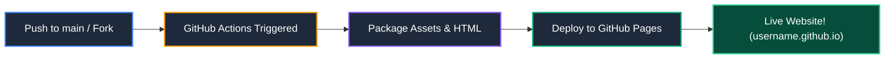

# 🚀 Quickstart Guide: Hosting on GitHub Pages via Actions

[](https://pages.github.com/)
[](https://github.com/features/actions)
[](#)
[](#)

> [!NOTE]
> This repository is pre-configured with an automated GitHub Actions CI/CD workflow located at [`.github/workflows/deploy.yml`](file:///.github/workflows/deploy.yml). Any student or peer who forks or clones this repo can host their own copy in **less than 60 seconds**!

---

## 🗺️ How It Works (Deployment Flow)



---

## 📋 Step-by-Step Instructions

### Step 1: Open Your Repository on GitHub
1. Open your web browser and navigate to your repository:
   ```text
   https://github.com/<YOUR-USERNAME>/<YOUR-REPOSITORY-NAME>
   ```

---

### Step 2: Set GitHub Pages Source to "GitHub Actions"

> [!IMPORTANT]
> This one-time setting tells GitHub to use the automated workflow in this repo rather than building from a legacy branch.

1. Click on the **⚙️ Settings** tab at the top right of your repository.
2. In the left navigation sidebar, scroll down to the **Code and automation** section.
3. Click on **Pages** (`/settings/pages`).
4. Under **Build and deployment**:
   - Locate the **Source** dropdown.
   - Change it from `Deploy from a branch` to **`GitHub Actions`**.

| Setting | Selection |
| :--- | :--- |
| **Build and deployment Source** | **GitHub Actions** ⚡ |

*(No save button is required; GitHub updates this instantly)*

---

### Step 3: Trigger Your Deployment

You can deploy using either of two methods:

#### ⚡ Method A: Automatic Deployment (Recommended)
Simply push any commit to the `main` branch. GitHub Actions will detect the push and automatically start the deployment job.

```bash
git add .
git commit -m "Update portfolio details"
git push origin main
```

#### 🖱️ Method B: Manual 1-Click Trigger via GitHub UI
1. Click on the **Actions** tab at the top of your repository.
2. In the left sidebar list of workflows, click **Deploy to GitHub Pages**.
3. On the right side, click the **Run workflow** dropdown button.
4. Ensure the branch selected is `main`, and click the green **Run workflow** button.

---

### Step 4: Access Your Live Website! 🌐

1. Stay on the **Actions** tab to watch your deployment in real-time *(typically takes ~30–45 seconds)*.
2. Once the job finishes with a green checkmark (✅ **Success**), click on the completed run.
3. In the summary page, your live URL will be displayed in the **deploy** step.
4. Your website is globally accessible at:

```text
https://<YOUR-USERNAME>.github.io/<YOUR-REPOSITORY-NAME>/
```

> [!TIP]
> You can also always find your live link under **Settings** ➔ **Pages** at any time.

---

## 🎨 How to Customize This Portfolio For Yourself

If you're using this project for your own portfolio:

| What to Change | File Location | Description |
| :--- | :--- | :--- |
| **Personal Info & Bio** | [`index.html`](file:///index.html) | Name, phone, email, birthday, location, and About Me intro |
| **Profile Picture** | [`assets/images/my-avatar.png`](file:///assets/images/my-avatar.png) | Replace with your photo / avatar |
| **Education & Experience** | [`index.html`](file:///index.html) | College details, CGPA, leadership roles, and company/org |
| **Skills & Tech Stack** | [`index.html`](file:///index.html) | Add your languages, frameworks, libraries, and tools |
| **Projects** | [`index.html`](file:///index.html) | Add your titles, descriptions, tech pills, and live demo links |
| **Project Images** | [`assets/images/`](file:///assets/images/) | Add screenshots or covers for your projects |
| **Blog Articles** | [`index.html`](file:///index.html) | Customize blog post titles, categories, and dates |

Once you've made your changes, commit and push:
```bash
git add .
git commit -m "Personalized portfolio details"
git push origin main
```
Your live site will update automatically in seconds!

---

## ❓ Troubleshooting & FAQs

<details>
<summary><strong>Q: Why did my action show "HttpError: Not Found - get a pages site"?</strong></summary>

This means GitHub Pages source was not yet switched to **GitHub Actions** in repository settings. Go to **Settings** ➔ **Pages** ➔ set **Source** to **GitHub Actions**, then re-run the workflow under the **Actions** tab.
</details>

<details>
<summary><strong>Q: Are images or styles broken on GitHub Pages?</strong></summary>

All paths in this repository use relative paths (e.g., `./assets/css/style.css` and `./assets/images/...`), which work across both root user pages (`username.github.io`) and sub-folder repository pages (`username.github.io/repo-name/`).
</details>

<details>
<summary><strong>Q: Can I use a custom domain?</strong></summary>

Yes! In **Settings** ➔ **Pages** ➔ **Custom domain**, enter your domain name (e.g. `yourname.dev`) and add a CNAME record in your DNS settings.
</details>

---

<p align="center">
  Crafted with ❤️ by <strong>Aditya Deore</strong><br>
  <sub>B.Tech Information Technology &bull; PCCOE Pune</sub>
</p>
